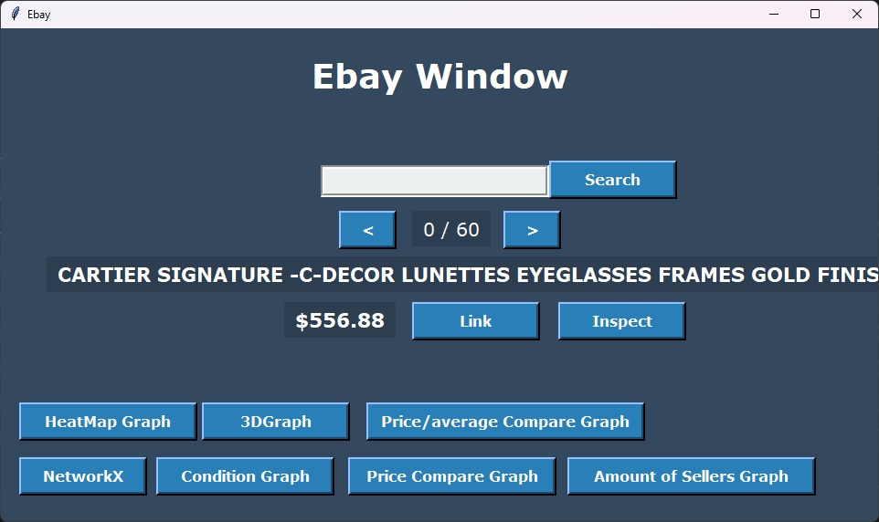
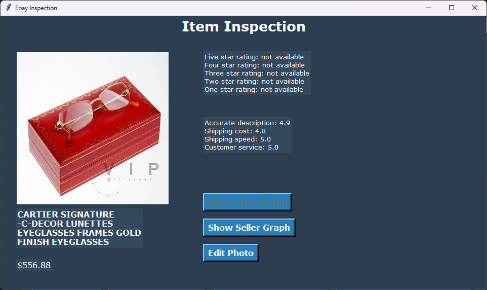
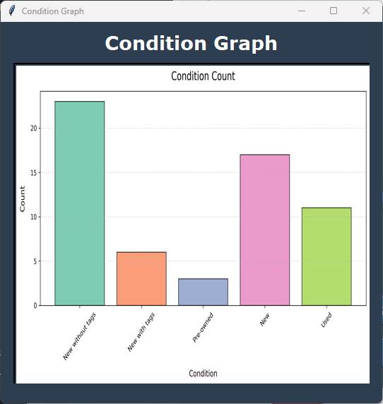
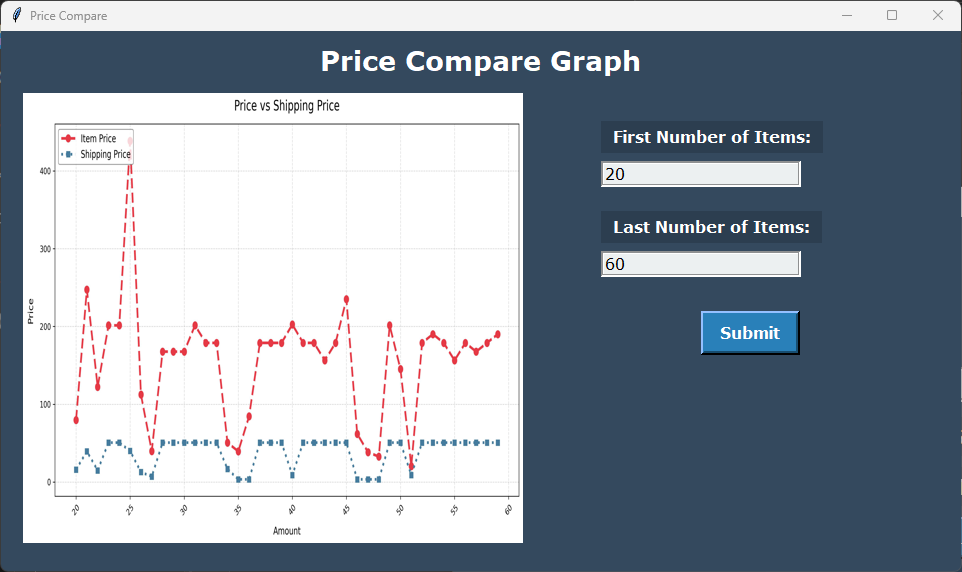
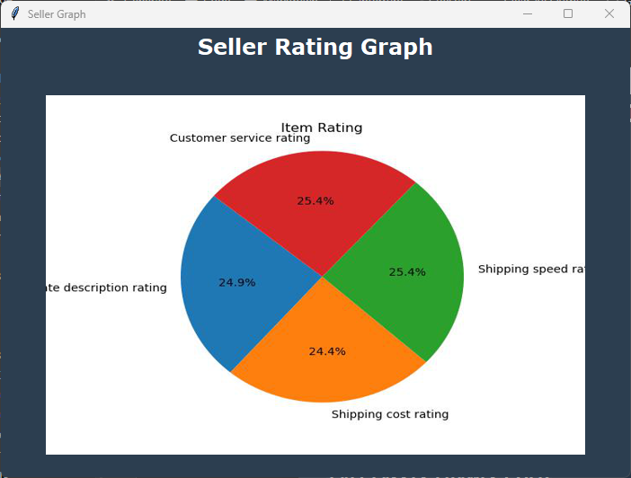
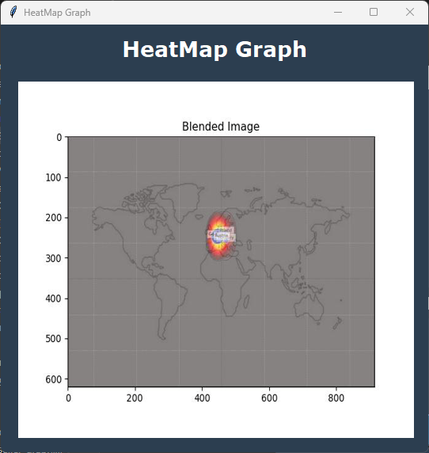
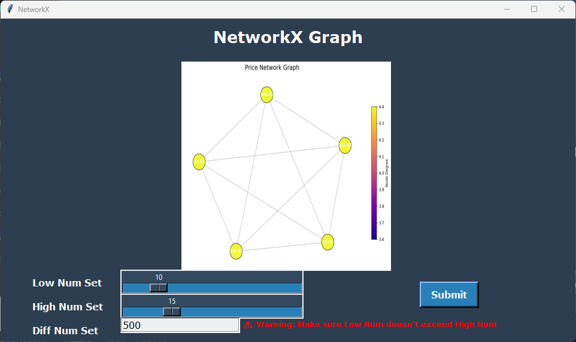
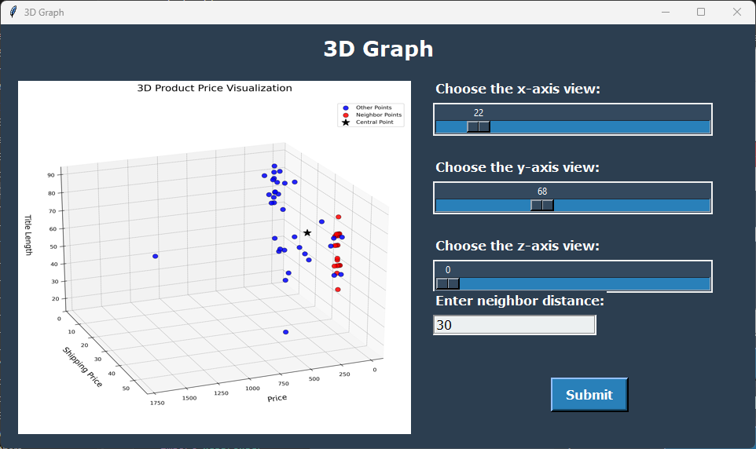
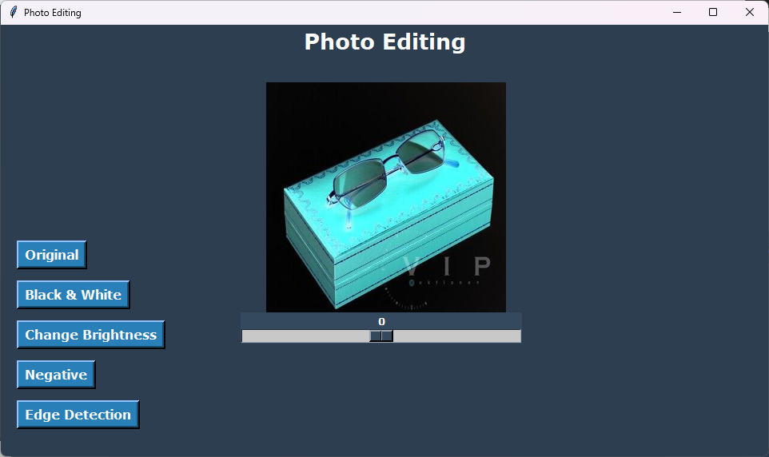

# 🛍️ eBay Web Scraper & Visual Analyzer

An interactive Python-based system that scrapes data from eBay, analyzes item and seller info, and visualizes results using custom-built GUIs and graphs.

Note: If the project does not function correctly, the file may be outdated in relation to the website.

> 📌 Created entirely by **Omar Ashraf Mahmoud**  
> Solo-developed, with all code and logic authored independently.  
> Includes photo editing tools, rating graphs, 3D comparisons, and even heatmaps.

---

## 🔍 Features

### 🖥️ Main Interface (eBay Window)
- Search for any item live on eBay
- Navigate search results using arrow buttons
- Open item links directly on eBay
- Inspect item and seller details
- Access multiple types of data-driven graphs

### 📊 Graphs & Visual Tools
- **Condition Graph** – shows item conditions and counts
- **Seller Count Graph** – visualizes how many times each seller has sold an item
- **Price vs Shipping Graph** – compares base price and shipping cost
- **Average Price Comparison** – highlights items priced above/below average
- **Heatmap Graph** – visualizes item delivery origins globally
- **3D Graph** – compares price, shipping, and title length with customizable camera angles
- **NetworkX Graph** – shows item relations based on value differences

### 🔍 Item Inspection Window
- View item & seller ratings
- View item image
- Generate rating pie charts (when data is available)
- Edit the item’s image in real-time

### 🖌️ Built-in Photo Editor
Apply filters and transformations like:
- Black & White
- Brightness Adjustment
- Negative Effect
- Edge Detection
- Reset to Original

---

## 🚀 Main Application File

**📄 DSAI 103 project.ipynb**  
This is the primary Jupyter Notebook that runs the entire system. It includes:
- Web scraping logic using Selenium and SerpAPI
- GUI design and controls
- Item/seller data visualization through graphs
- Built-in photo editing tools

👉 [Click here to open the main notebook](./DSAI%20103%20project.ipynb)

---

## ⚙️ How to Run the App

> 💡 This project is implemented as a Jupyter Notebook (`.ipynb`)

### ✅ Setup Requirements
- Python 3.x
- Required libraries:
  - selenium
  - requests
  - bs4 (BeautifulSoup)
  - serpapi
  - pandas
  - matplotlib
  - networkx
  - numpy
  - opencv-python (cv2)
  - Pillow (PIL)
  - webbrowser (built-in)
  - os (built-in)

- Additional requirements:
  - Correct version of ChromeDriver installed
  - Stable internet connection for live scraping

### 🧪 Execution Steps
1. Open the `.ipynb` notebook
2. Run each cell sequentially **before** running the GUI cell
3. For demo:
   - Input item name in the first cell
   - Run scraping, graph loading, and visualization steps
4. Finally, execute the GUI cell to launch the full app

> 📄 Full detailed usage instructions available in the [project report PDF](./eBay%20System%20Application%20Report.pdf)

---

## ⚠️ Notes & Tips

- Some windows and graphs may take time to load (especially heatmap & NetworkX)
- Download and place `world.jpg` in your folder for the heatmap to work:  
  [Download Link](https://media.istockphoto.com/id/936410448/vector/black-outlined-world-map.jpg)
- To reduce lag, avoid enabling full data loading unless needed
- Enable advanced data fetching by uncommenting marked sections in the GUI cell
- Use specific keywords (like `"glasses"`) for better scraping accuracy

---

## 📸 Screenshots

### 🧭 Main Menu
Displays the starting window where the user selects the scraping platform.
  

---

### 🔍 Item Inspection Window
Displays detailed info for the selected item and seller, with image and rating data.

---

### 📊 Condition & Seller Graphs
Visualizes the condition of items and how many units each seller sold.

---

### 🥧 Pie Chart for Ratings
Generates pie charts for both item and seller ratings (when available).

---

### 🌍 Heatmap Graph
Displays the origin of item delivery on a world map using a heatmap.

---

### 🕸️ NetworkX Graph
Analyzes price-based similarity between items using NetworkX.

---

### 🔺 3D Graph
Plots item price, shipping, and title length in a 3D space for correlation analysis.

---

### 🎨 Photo Editing Tools
Applies visual transformations to item images like grayscale, negative, brightness, and edge detection.

---

## 👤 Author

**Omar Ashraf Mahmoud**  
🎓 Computer Science Major – Data Science & Artificial Intelligence (DSAI)  
🏫 Zewail City of Science and Technology  
🆔 Student ID: 202400725  
📧 College Email: s-omar.amahmoud@zewailcity.edu.eg  
📬 Personal Email: omar.ashraf.hamed2017@gmail.com

---

## 📄 License

This project is licensed under the [MIT License](./LICENSE).  
Feel free to use, modify, and build upon this work — just make sure to give credit to the original author.

<!-- Test push from VS Code -->
